# GestAsocia

**GestAsocia** es un sistema tipo **SaaS para escritorio (Windows)** diseñado para la **gestión integral de asociados, cargas familiares, historial clínico y reservas de horas**.  
La aplicación es **solo Desktop**, no está pensada para web ni dispositivos móviles.  
Está desarrollada en **Flutter Desktop** y utiliza **Firebase** como backend.

Repositorio: [https://github.com/benjamon19/Software_desktop_Gestasocia.git](https://github.com/benjamon19/Software_desktop_Gestasocia.git)

---

## Login

**Login del software**  


**Código de acceso doble factor**  
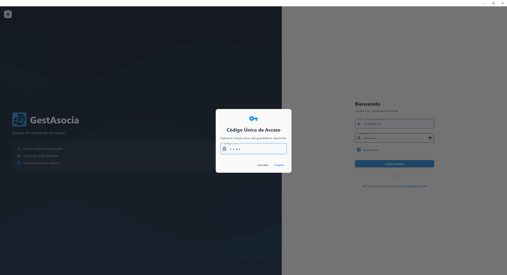

---

## Dashboard
 
El **dashboard** muestra gráficas, cartas y estadísticas principales de la aplicación.
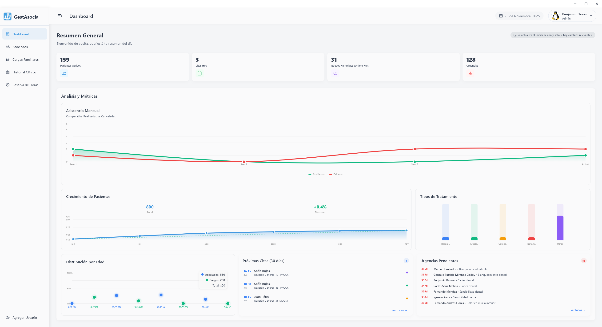

---

## Gestión de asociados

Permite:

- Búsqueda por SAP, RUT o código de barras.  
- CRUD completo de asociados.  
- Exportación de datos y acceso a historial.  

**Vista lista de asociados**  
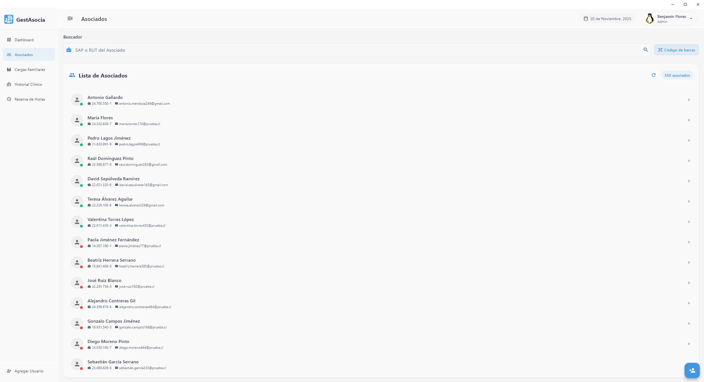

**Crear nuevo asociado** este dialog tiene la misma estética que todos los demás del sistema.
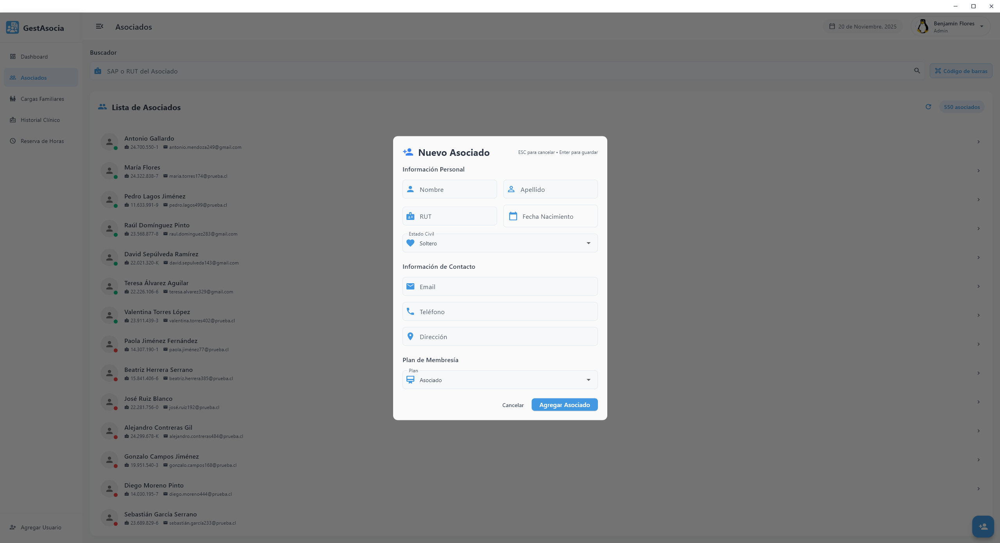

**Vista perfil del asociado** 
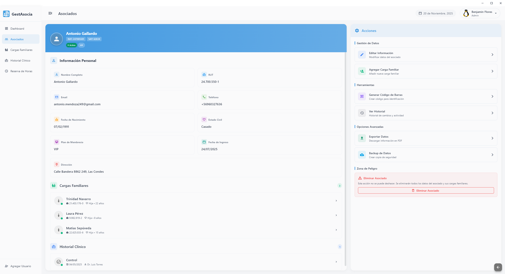

---

## Gestión de cargas familiares

Permite:

- CRUD completo de cargas.  
- Transferencia de cargas entre asociados.  
- Exportación de datos e historial.   

**Vista lista de cargas familiares**  
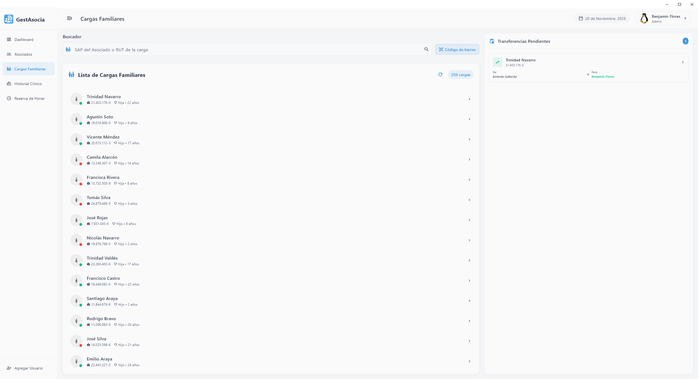

**Vista perfil de la carga familiar** 
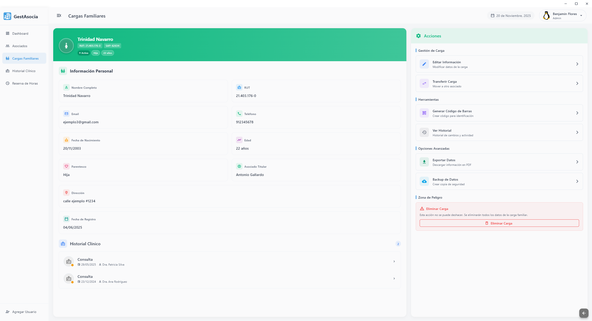

---

## Gestión de historial clínico

Permite:

- CRUD completo de registros clínicos.  
- Exportación de datos e historial.  
- Adjuntar documentos (radiografías) usando Storage. 

**Vista lista de historiales y formulario**  
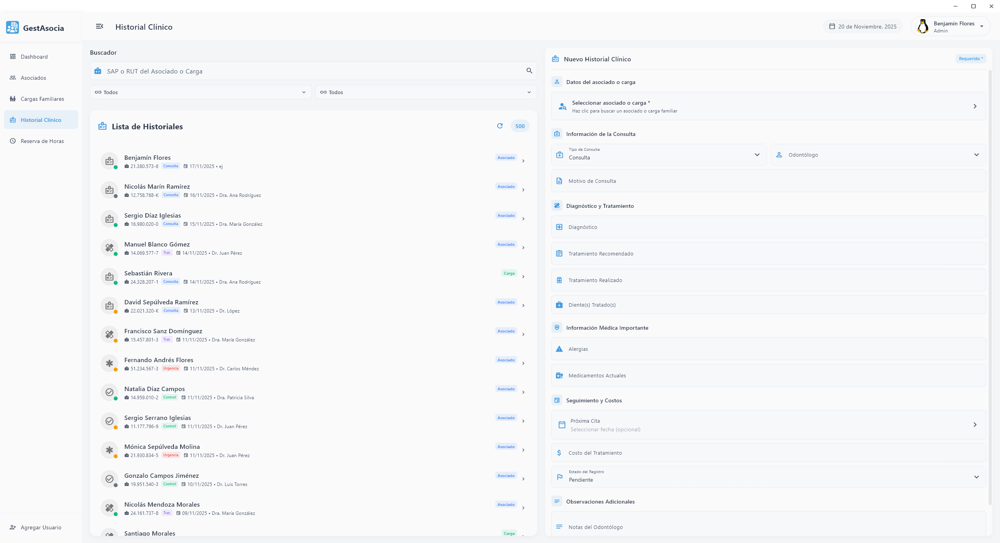

**Vista perfil de un historial clínico** esto aplica para asociado y carga.
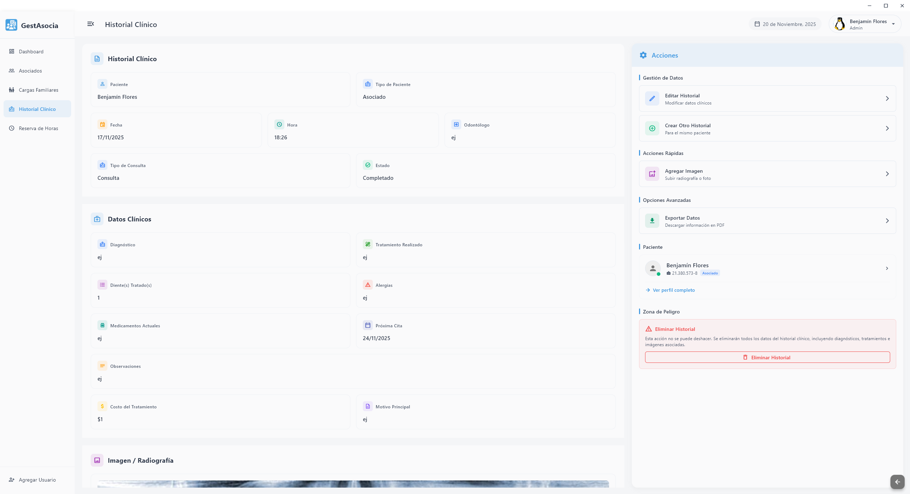

---

## Gestión de reserva de horas

Permite:

- CRUD completo de reserva de horas por paciente del sistema.   

**Vista reserva de horas diarias**  
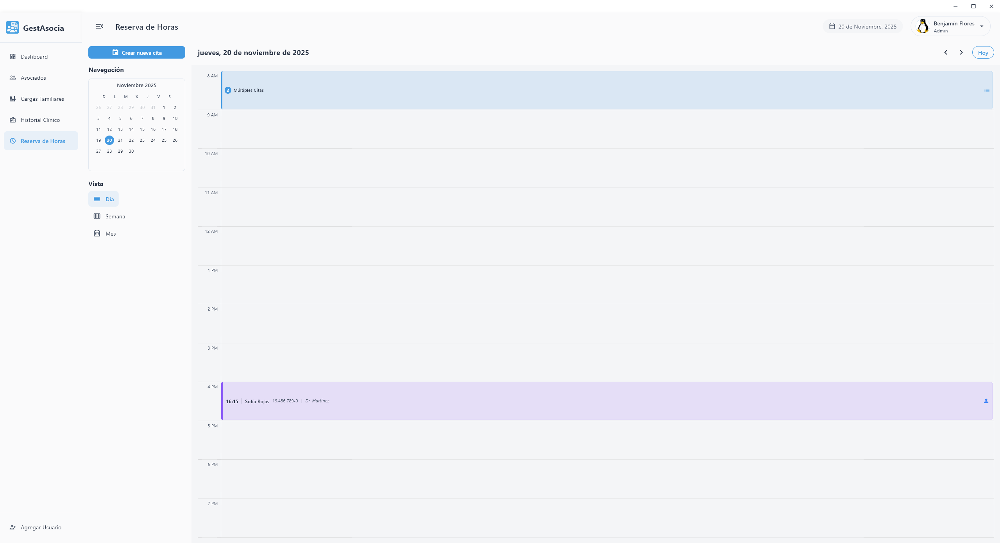

**Vista crear nueva reserva**
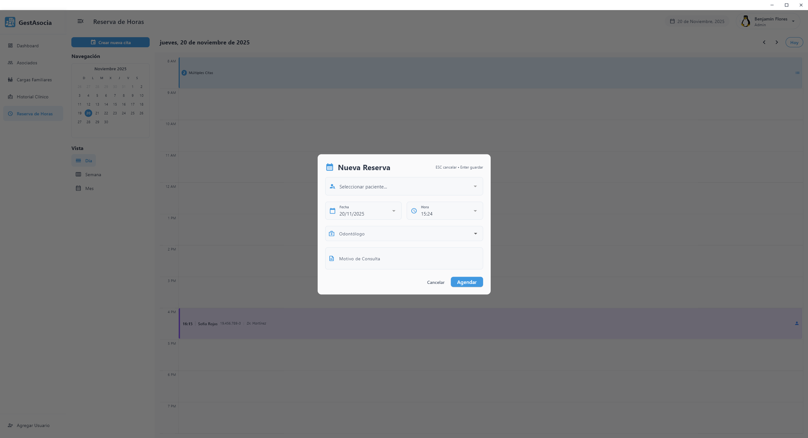

**Múltiple cita** cuando hay más de una cita en un horario despliega este dialog.
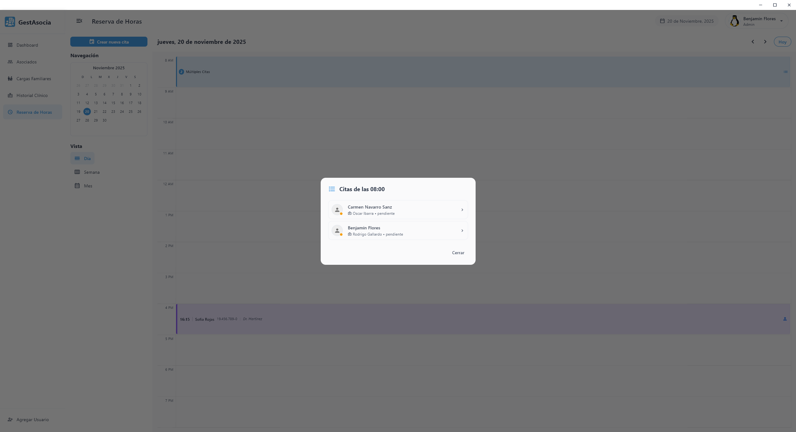

**Detalle de la cita** cuando se le hace click a una cita despliga este dialog con los detalles y se puede solicitar la confirmación por Whatsapp.
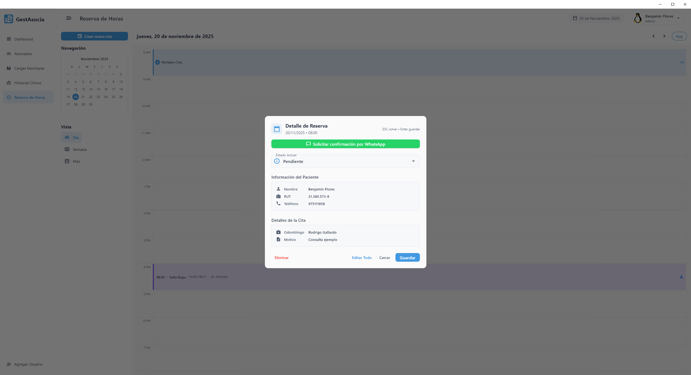

**Vista reserva de horas semanal**
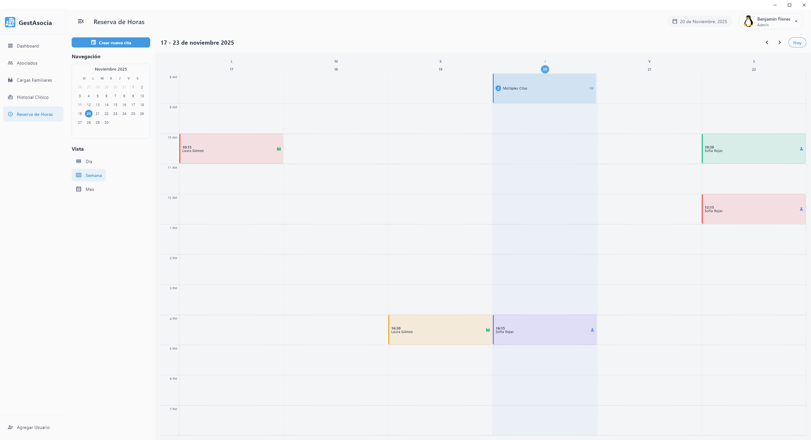

**Vista reserva de horas mensual**
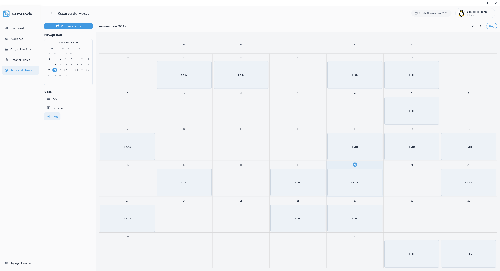

---

## Gestión de perfil y configuración

- Cambio de contraseña.  
- Cambio de foto mediante Storage.  
- Cierre de sesión.  
- Cambio de tema de la aplicación.

**Tema claro**
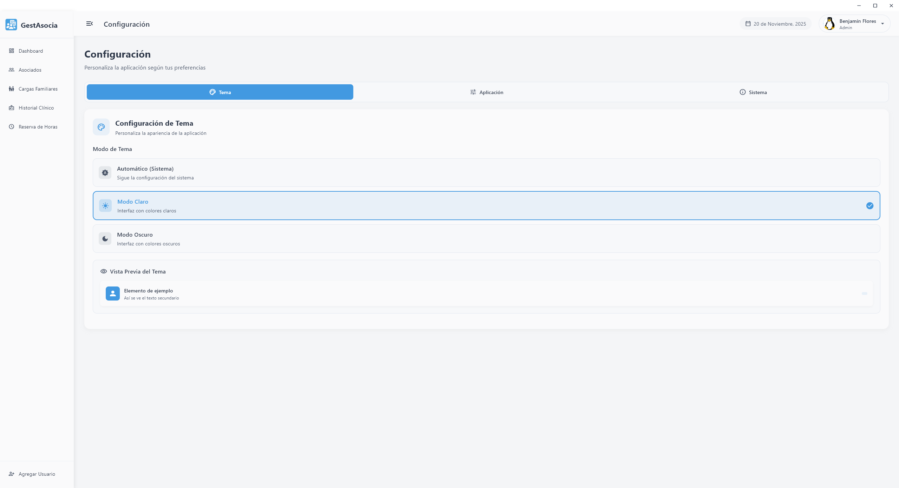

**Tema oscuro**
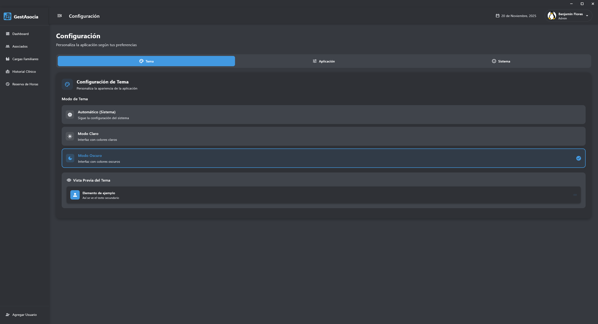

**Creación de usuarios** solo a los administradores del sistema se les permite crear usuarios.
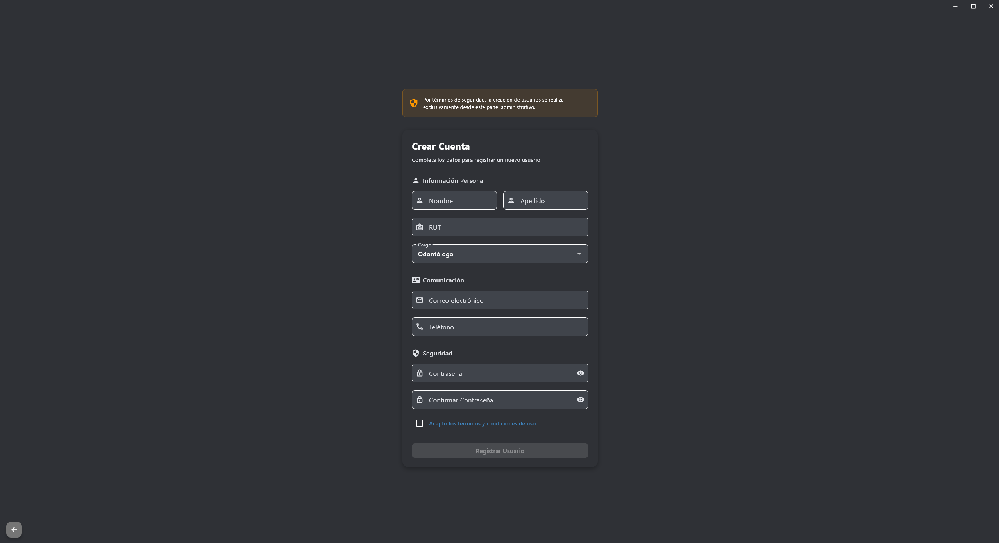

---

## Arquitectura del proyecto

Aplicación modular basada en 3 capas:

```bash
lib/
│
├─ bindings/
├─ config/
├─ controllers/
├─ dialogs/
├─ models/
├─ pages/
│ ├─ dashboard/
│ │ ├─ main_view.dart
│ │ └─ sections/...
│ ├─ perfil/
│ │ ├─ main_view.dart
│ │ └─ sections/...
│ └─ configuracion/
│ ├─ main_view.dart
│ └─ sections/...
│
├─ modules/
│ ├─ gestion_asociados/
│ │ ├─ main_view.dart
│ │ └─ sections/...
│ ├─ gestion_cargas_familiares/
│ │ ├─ main_view.dart
│ │ └─ sections/...
│ ├─ gestion_historial_clinico/
│ │ ├─ main_view.dart
│ │ └─ sections/...
│ └─ gestion_reserva_horas/
│ ├─ main_view.dart
│ └─ sections/...
│
├─ shared/
│ ├─ dialogs/
│ ├─ widgets/
│ └─ main_view.dart
│
└─ utils/
```
---

## Tecnologías usadas

- Flutter Desktop (UI y lógica de la app).  
- Firebase Auth (autenticación).  
- Firestore (base de datos).  
- Firebase Storage (archivos y fotos).  
- GetX (gestión de estado y rutas).  
- Shared Preferences (almacenamiento local).  

---

## Instalación y ejecución

1. Clonar el repositorio:

```bash
git clone https://github.com/benjamon19/Software_desktop_Gestasocia.git
cd Software_desktop_Gestasocia
```

2. Instalar dependencias:

```bash
flutter pub get
```

3. Ejecutar la app en Windows:

```bash
flutter run -d windows
```